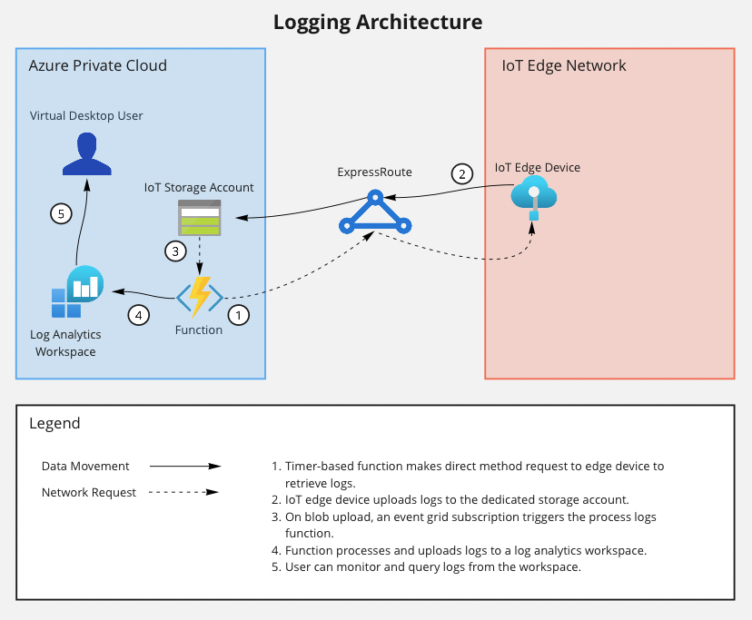

# iot-edge-logger

[](https://img.shields.io/badge/python_v3.9-blue?logo=python&logoColor=yellow) [](https://img.shields.io/badge/pre--commit-blue?logo=pre-commit&logoColor=FAB040) [](https://img.shields.io/badge/keep_a_changelog-blue?logo=keepachangelog&logoColor=E05735) [](https://img.shields.io/badge/GitHub_Actions-blue?logo=githubactions&logoColor=black) [](https://img.shields.io/badge/PyPI-blue?logo=pypi&logoColor=yellow)

This package is a custom log formatter to standardize, collect and analyze logs from IoT Edge Devices in an Azure Log Analytics Workspace.

[Source code](https://github.com/dgonzo27/py-iot-utils/tree/master/iot-edge-logger) | [Package PyPI](https://pypi.org/project/iot-edge-logger/)

## Table of Contents

- [Versioning](#versioning)
- [Getting Started](#getting-started)
  - [Prerequisites](#prerequisites)
  - [Basic Examples](#basic-examples)
- [Init Logging Method](#init-logging-method)
- [Logging Considerations](#logging-considerations)
  - [Ideal Scenario](#ideal-scenario)
  - [Example Architecture](#example-architecture)

## Versioning

This repository adheres to [Semantic Versioning](https://semver.org/spec/v2.0.0.html). It will be maintained through the `CHANGELOG.md` and in GitHub Releases. **It's important to note** that you must maintain the version with your releases in `iot/edge/logger/_version.py`, otherwise a new package version will fail to get published.

## Getting Started

This section provides basic examples with the `iot-edge-logger`.

### Prerequisites

- Python 3.7 or later is required to use this package.

### Basic Examples

1. Install via [pip](https://pypi.org/project/pip/):

   ```sh
   pip install iot-edge-logger
   ```

2. Import and say hello:

   ```python
   from iot.edge.logger import __version__


   print(f"hello world from iot-edge-logger version: {__version__}")
   ```

3. Basic usage:

   ```python
   from iot.edge.logger import init_logging

   # setup logging
   logger = init_logging(module_name="my_iot_module")


   logger.info("I am alive!")
   logger.warning("Plotting global takeover...")
   logger.error("Humans have become suspicious, shutting down")
   ```

4. Log output:

   ```sh
   <6> 2022-08-02 19:04:13,015 [INF] my_iot_module I am alive!
   <4> 2022-08-02 19:04:13,015 [WRN] my_iot_module Plotting global takeover...
   <3> 2022-08-02 19:04:13,015 [ERR] my_iot_module Humans have become suspicious, shutting down
   ```

## Init Logging Method

A custom logger to provide well formatted logging for a given IoT Edge Module - or any Python program.

```python
init_logging(
    module_name,
    level="DEBUG",
    format="<%(levelno)s> %(asctime)s [%(levelname)s] %(module_name)s %(message)s",
    datefmt=None,
    timespec="milliseconds",
    timezone="UTC",
)
```

**Parameters**

- `module_name` str

  The name of the IoT Edge module that is using this logger. Used for filtering and querying in log analytics - use "this_format_for_module".

- `level` Optional[str]

  The logging level. Default is "DEBUG".

- `format` Optional[str]

  The desired logging format. Default seen above.

- `datefmt` Optional[str]

  The desired date format. Default is None.

- `timespec` Optional[str]

  The time accuracy represented in log records. Default is "milliseconds".

- `timezone` Optional[str]

  The timezone represented in log records. Default is "UTC".

**Returns**

Returns a `logging.Logger` object.

**Valid Timezones**

- US/Alaska
- US/Central
- US/Eastern
- US/Mountain
- US/Pacific
- UTC

## Logging Considerations

- [Retrieve log](https://docs.microsoft.com/en-us/azure/iot-edge/how-to-retrieve-iot-edge-logs?view=iotedge-2018-06#recommended-logging-format) methods from the edge agent are tightly coupled with [syslog severity level](https://en.wikipedia.org/wiki/Syslog#Severity_level) standards. For the best compatibility with the log retrieval feature provided by Azure, the recommended logging format is implemented by default with this package.

- Some applications provide verbose logging, generating a lot of trace and information logs. While it's beneficial to know that your application is healthy, it is more important to take action when things go wrong and keep costs under control. Consider configuring with logs that match `warning` level or higher.

### Ideal Scenario

The ideal scenario for leveraging `iot-edge-logger` would involve a custom module running on an IoT edge device.

Say you wrote a Python-based module for your edge device, but you're looking for a more centralized approach to logging - the default Azure UI to stream logs just isn't enough to scale your monitoring requirements.

By leveraging the same built-in [retrieve logs](https://docs.microsoft.com/en-us/azure/iot-edge/how-to-retrieve-iot-edge-logs?view=iotedge-2018-06#recommended-logging-format) method that the edge agent is using to display logs in Azure, we can define our own process for pulling, storing and analyzing edge device logs.

### Example Architecture

An example architecture of the ideal scenario defined above may look something like this:



And querying in log analytics would look something like this:

```sql
iotedgemodulelogs
| where timestamp_t <= ago(24h)
| project timestamp_t, moduleId_s, logLevel_d, Message
```
